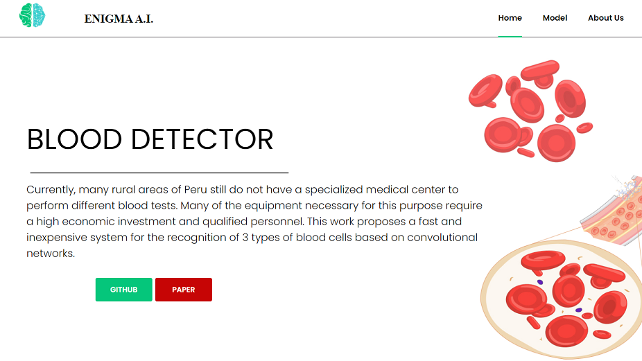

<h2 align="center">
<p>Blood Cells Detection System for rural zones at Peru 🔬🩸</p>
</h2>

<h2 align="center">
<p></p>


<p></p>
</h2>


## 📜 Abstract 
Currently, many rural areas of Peru still do not have a specialized medical center to perform different blood tests. Many of the equipment necessary for this purpose require a high economic investment and qualified personnel. This work proposes a fast and inexpensive system for the recognition of 3 types of blood cells based on convolutional networks. The ConvNet model is characterized by having reduced inference times, and also ease of deployment in hardware with reduced resources such as a Raspberry Pi. 

The paper is available at this [link](https://drive.google.com/file/d/1FEv4wR2A_vQybh7ARqoT6nD2xu_SC8T3/view?usp=sharing).

## 🆕 Update
- 29/11/20: Improved and more personalized interface. Discontinued use
 **Streamlit** due to the limitation in the customization layer; it was replaced with native CSS and HTML, rendered by **Flask**. Improved file management system, now allows files to be stored on the server, using FLASK's own security protocols.

 TODO:
- ✅ File storage directly on the server with Flask
- ✅ Responsive web design
- ⬜️ Support for React and Django
- ⬜️ Model quantization
- ⬜️ Support for AWS and Docker

## 📖 Content
The following tree shows the structure of the application:
```
|- master-RasPi-BloodView/
|   |- Blood-Detector/
|       |- runs/
|           |- FINAL/   
|               |- weights/
|                   |- best.pt
|                   |- other torchscript files ..
|           |- ..
|       |- web/
|           |- static/..
|           |- template/..
|           |- index.py
|       |- blood_detection.py
|       |- create_csv.py
|       |- data_viz.py
|       |- data_manage.py
|       |- export_jit.py
|       |- train.py
|      
|   |- Dataset/
|       |- BCCD/
|           |- Annotations/*.xml
|           |- JPEGImages/*.jpg
|           |- ModelData/
|               |- images/
|                   |- train/*.jpg
|                   |- val/*.jpg
|               |- labels/
|                   |- train/*.txt
|                   |- test/*.txt
|           |- annotations_blood_cells.csv
|           |- bloodData.yaml and LICENSE
|   
|   |- YOLOv5/
|       |- data/..
|       |- models/..
|       |- utils/..
|       |- detect.py (modificated)
|       |- train.py
|       |- test.py
|       |- LICENSE
|
|   |- README.md
```
## ℹ️ Instructions

Install all dependencies with the command ```pip install -r requirements.txt```. To install Pytorch ARM on the RaspBerry, you need to compile it by following these [instructions](https://mathinf.eu/pytorch/arm64/). 
Similarly, you need to compile OpenCV by following this [tutorial](https://qengineering.eu/install-opencv-4.2-on-raspberry-pi-4.html) (it will take about 5 hours). 

Pytorch and OpenCV are not officially available for RaspBerry at the time of publication of this work (11/30/2020).

* Note: All the commands described below are executed in folder Blood-Detector.

1. Data collection and pre-processing
    Original Dataset available at [here](https://github.com/Shenggan/BCCD_Dataset). 
    Place the data following the tree structure shown above. Run the following command to process the .xml files and get a .csv file with the coordinates of each blood cell (bounding box and centroid axis) per image.
    ```
       python create_csv.py
    ```
    
    If you want to display the previously labeled bounding boxes, you can run the following command.
    ```
       python data_viz.py
    ```
    
    Finally we need to split our data into a validation and training set. The following command generates .txt files for the tags and also copies the images to the 'train' and 'val' folders.
    ```
       python data_manage.py
    ```

2. Train and export model

    * Note: If you have other data, modify the .yaml file inside the Dataset folder.

    To train the model, just run the following command (you can modify this file to change the hyperparameters). 
    Training for 100 epochs (on an Nvidia 1050Ti graphics card) took about 1 hour.
    ```
       python train.py
    ```
    The model is saved in the 'runs' folder. 

    To export the model in JIT format you need to run the following command.
    ```
       python export_jit.py
    ```
    The generated file will be saved in the same folder 'runs'.

3. Test model

    To run the application, inside the 'web' folder execute the following command.
    ```
       python index.py
    ```
    
    Below is a screenshot from PC and mobile.
    
<p align="center">
    <br>
    
    <p align="center">PC</p>
    <br>
</p>

<p align="center">
  
  <p align="center">Mobile</p>
</p>


## 👨‍💻 Maintainers
* Cristhian Wiki, Github: [HiroForYou](https://github.com/HiroForYou) Email: csanchezs@uni.pe

## 🙏🏽 Special thanks
* Version 1.5:
Many thanks to the members of ENIGMA-AI (Cesar and Alexander) for the commitment presented in the project for almost two months.
This work would not have been possible without team support.
* Version 2:
*Soon*